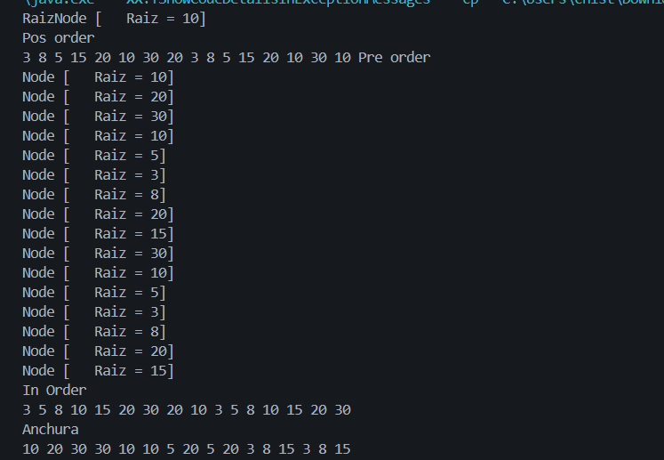

# Práctica: Estructuras Dinámicas Lineales

## Datos del Estudiante
- **Nombre:** Christian Villa
- **Curso:** Grupo 3
- **Fecha:** 17/06/2026

---
## Practica 1 
- **Fecha:** 16/06/2026

**Descripción General de la Practica 1 :**
En esta primera practica creamos algunos metodos los cuales nos vana  permitir imprimir un arbol binario en los siguientes ordenes ; PreOrden , InOrder,PosOrder, todos estos para poder determinar si un arbol binario ya dado se puede visualizar de una mejor manera todo este codigo para eso nos ayudamos de una clase `IntTree ` en la cual pondremos todos los metodos para poder organizar los arboles y en el `App ` solo los llamamos para imprimirlos.

### Captura de salidas en consola
## Practica 1  :

## Practica 2 
- **Fecha:** 17/06/2026

**Descripción General de la Practica 2 :**
En la practica del dia de hoy hicimos una clase `BinartTree ` en la cual aremos los mismos metodos de la clase anterior creada q es la `IntTree` pero con la diferencia que en la clase`BinaryTree` la vamos a hacer una clase generica , ademas de los metodos ya creados vamos a crear otros dos en los cuales vamos a determinar la `Altura` de nuestro arbol y otra que nos ayudara a ver el peso osea cuantos nodos en total tiene el arbol con un metodo para calcular dicho `Peso` y tambien probamos este arbol pero comparandolo entre nombres embes de valores por lo cual nos podemos ayudar mucho del `CompareTo` esto ara que comparemos los valores por edad y por nombres.

### Captura de salidas en consola
## Practica 2  :

## Conclusiones

El estudiante debe redactar al menos tres conclusiones propias relacionadas con los arboles.

- Conclusión 1: Como mi primera conclusion puedo decir que todos los metodos creados facilitan mucho a la visualizacion de estos arboles.
- Conclusión 2:Al crear metodos de impresion y otros para comparar hace muy entendible el tema lo que si hay q tener cuidado al comparar datos y tener en cuenta que datos comparamos etc.
- Conclusión 3: Hay que tener cuidado al comparar datos ya que si no son compatibles la comparacion no servira y el codigo nos dara error para eso exisen muchos metodos que nos van a permitir saber como  si la comparacion es correcta solo queda pensar bien.

