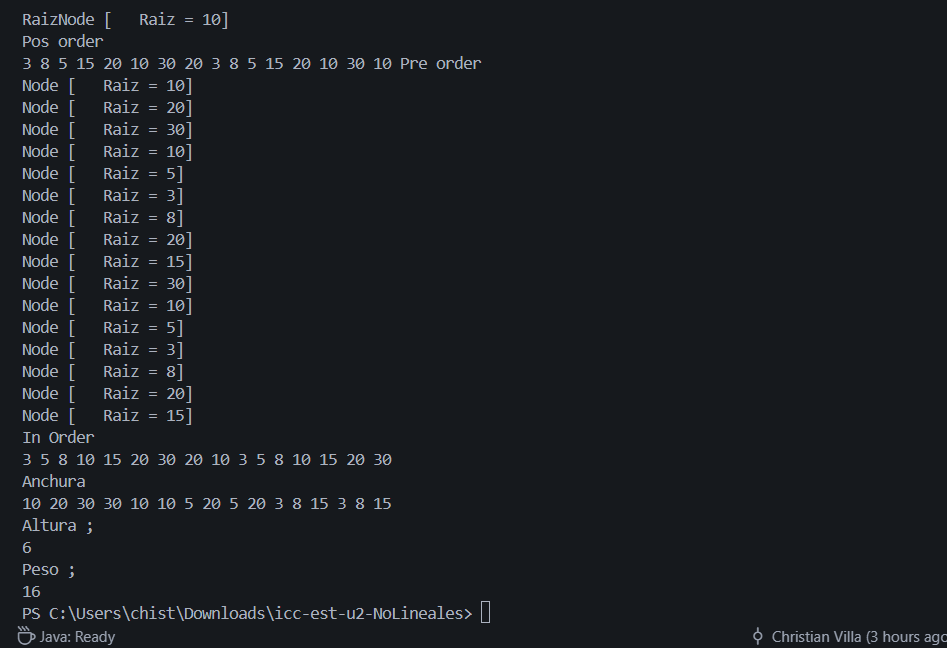
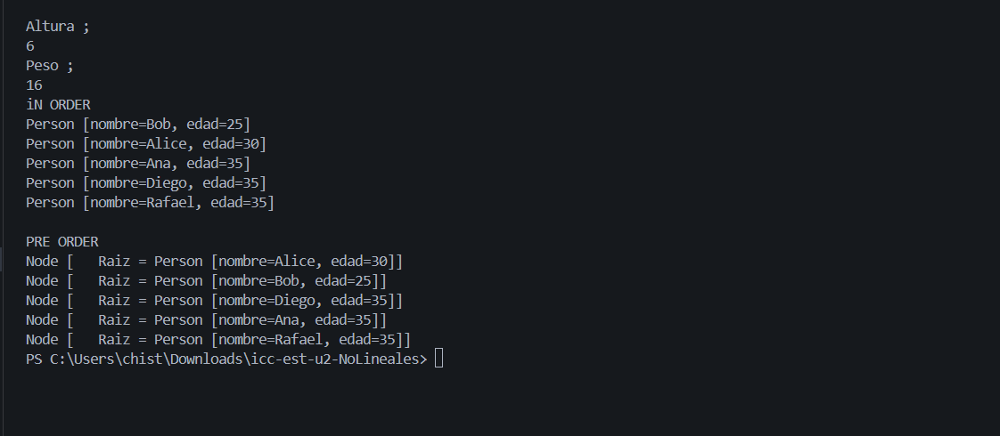
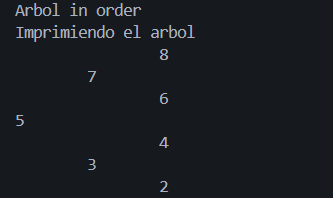
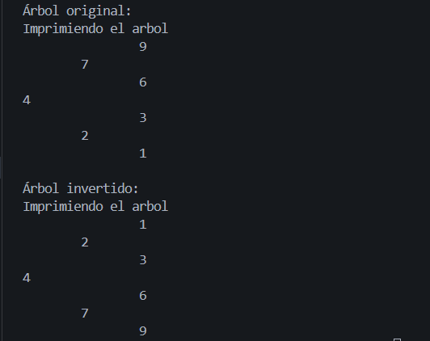
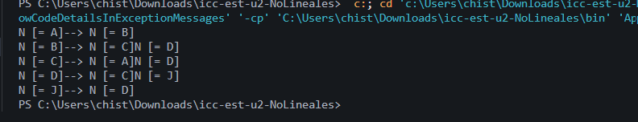
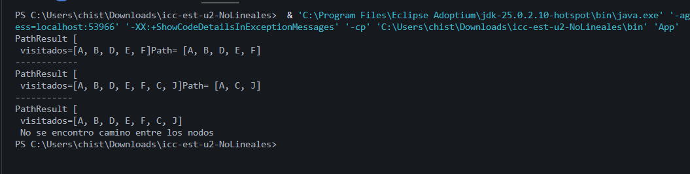

# Práctica: Estructuras Dinámicas Lineales

## Datos del Estudiante
- **Nombre:** Christian Villa
- **Curso:** Grupo 3
- **Fecha:** 17/06/2026

---
## Practica 1 
- **Fecha:** 16/06/2026

**Descripción General de la Practica 1 :**
En esta primera practica creamos algunos metodos los cuales nos vana  permitir imprimir un arbol binario en los siguientes ordenes ; PreOrden , InOrder,PosOrder, todos estos para poder determinar si un arbol binario ya dado se puede visualizar de una mejor manera todo este codigo para eso nos ayudamos de una clase `IntTree ` en la cual pondremos todos los metodos para poder organizar los arboles y en el `App ` solo los llamamos para imprimirlos. 

## Creacion de la clase `Node`
Lo q va a hacer esta clase va a ser que va a tener un valor de tipo entero el cual va a tener referencia de su hijo derecho y de su hijo izquierdo lo cual es bueno ya que nos va a permitir tener la estructura del arbol binario.
Esta clase recibira tres atributos:
```java
    private T value;
    private Node<T> left;
    private Node<T> right;
```
Ademas de sus respectivos metodos como lo son 
```java
    public Node<T> getValue(){}
    public Node<T> getLeft(){}
    public Node<T> getRight(){}
    // Y el toString
    @Override
    public String toString() {
        return "Node [   Raiz = " + value + "]";
    }
```
## Creacion de la clase `IntTree`
En esta clase vamos a tener todos los metodos para crear el arbol binario y  realizar las distintas clases de impresiones  determinar la altura su peso , estos metodos son:
```java
private Node<Integer> insertRecursive(Node<Integer> actual, Node<Integer> nodeIngresado) {}

public void preOrder() {}

private void preOrderRecursivo(Node<Integer> actual) {}

public void posOrder() {}

private void posOrderRecursivo(Node<Integer> actual) {}

public void inOrder() {}

private void inOrderRecursivo(Node<Integer> actual) {}

public void Anchura() {}

public int altura() {}

private int alturaRecursivo(Node<Integer> actual) {}

public int peso(){}

private int pesoRecursivo(Node<Integer> actual) {}
```

Estos metodos son los que nos ayudaran a imprimir el arbol en las diferentes formas que conocemos como `InOrder`- `PostOrder`-`PreOrder` ademas podremos ver la `Altura` y el `Peso` de nuestro arbol.

### App
```java
private static void runIntTree(){
    IntTree arbolNumeros = new IntTree();

    arbolNumeros.setRoot(10);
    System.out.println("Raiz" + arbolNumeros.getRoot());

    Node<Integer> node2 = new Node<>(20);
    Node<Integer> node3 = new Node<>(30);
    Node<Integer> node4 = new Node<>(40);
    Node<Integer> node5 = new Node<>(50);

    Node<Integer> root = arbolNumeros.getRoot();
    root.setLeft(node2);
    root.setRight(node3);

    node2.setLeft(node3);
    node4.setLeft(node4);
    node5.setLeft(root);

    arbolNumeros.insert(10);
    arbolNumeros.insert(5);
    arbolNumeros.insert(3);
    arbolNumeros.insert(8);
    arbolNumeros.insert(20);
    arbolNumeros.insert(15);

    System.out.println("Pos order");
    arbolNumeros.posOrder();
    System.out.println("Pre order");
    arbolNumeros.preOrder();
    System.out.println("In Order");
    arbolNumeros.inOrder();
    System.out.println();
    System.out.println("Anchura");
    arbolNumeros.Anchura();
    System.out.println();
    System.out.println("Altura ; ");
    arbolNumeros.altura();
    System.out.println(arbolNumeros.altura());

    System.out.println("Peso ; ");
    arbolNumeros.peso();
    System.out.println(arbolNumeros.peso());

    }
```
En la clase App  vamos a añadir diferentes valores a los distintos nodos para despues con los metodos que creamos en la clase `InTree` los cuales nos van a permitir tener los diferentes tiposd e impresiones que hemos venido visualizando.

## Captura de salidas en consola




## Practica 2 
- **Fecha:** 17/06/2026

**Descripción General de la Practica 2 :**
En la practica del dia de hoy hicimos una clase `BinartTree ` en la cual aremos los mismos metodos de la clase anterior creada q es la `IntTree` pero con la diferencia que en la clase`BinaryTree` la vamos a hacer una clase generica , ademas de los metodos ya creados vamos a crear otros dos en los cuales vamos a determinar la `Altura` de nuestro arbol y otra que nos ayudara a ver el peso osea cuantos nodos en total tiene el arbol con un metodo para calcular dicho `Peso` y tambien probamos este arbol pero comparandolo entre nombres embes de valores por lo cual nos podemos ayudar mucho del `CompareTo` esto ara que comparemos los valores por edad y por nombres.

Clase `BinaryTree` Metodos en esta clase:
```java
private Node<T> insertRecursive(Node<T> actual, Node<T> nodeIngresado) {}

public void preOrder() {}

private void preOrderRecursivo(Node<T> actual) {}

public void posOrder() {}

private void posOrderRecursivo(Node<T> actual) {}

public void inOrder() {}

private void inOrderRecursivo(Node<T> actual) {}

public void Anchura() {}

public int altura() {}

private int alturaRecursivo(Node<T> actual) {}

public int peso(){}

private int pesoRecursivo(Node<T> actual) {}

```
Son Exactamente los mimso metodos que en la clase IntTree
Los cuales nos van a  ayudar a imprimir de la misma forma que en la clase `IntTree` pero a diferencia que la clase `BinaryTree` es una clase Generica lo cual hace que en los metodos tengan un tipo de dato`Node<T> actual`.

### App
```java
private static void runPersonTree(){
    BinaryTree<Person> personTree = new BinaryTree<>();
    personTree.insert(new Person("Alice", 30));
    personTree.insert(new Person("Bob", 25));
    personTree.insert(new Person("Diego", 35));
    personTree.insert(new Person("Rafael", 35));
    personTree.insert(new Person("Ana", 35));

    System.out.println("iN ORDER" );
    personTree.inOrder();
    System.out.println();
    System.out.println("PRE ORDER ");
    personTree.preOrder();

    }
```

### Captura de salidas en consola



## Practica 24/6/2026
En la practica del dia de hoy realizamos una clase llamada `Set` el cual incluia los metodos `HashSet` , `LinkedHashSet` , `TreeSet`, `TreeSetConComparador`, `HashSetContacto`los cuales nos van a ayudar a imprimir un arreglo de numeros dados para mostrar los elementos ingresados ya q gracias al hasshet  nos v aa permitir que no ingresen elementos duplicados a nuestro arreglo o arbol 
```java
public class Sets {

    
    public Sets() {
    }


    //Metodos
    public Set<String> construirHashSet(){
        Set<String> hashSet = new HashSet<>();
        hashSet.add("A");
        hashSet.add("B");
        hashSet.add("C");
        hashSet.add("A");
        hashSet.add("D");
        hashSet.add("E");
        hashSet.add("F");
        hashSet.add("1Ggggggeegeg");
        hashSet.add("2G2gggggeegeg");
        hashSet.add("3Gggggeegeg");
        hashSet.add("4Ggggggeegeg");
        hashSet.add("5Ggggggeegeg");
        hashSet.add("5Ggggggeegeg");
        hashSet.add("6Ggggggeegeg");
        hashSet.add("G7gggggeegeg");
        return hashSet;

    }

    public Set<String> construirLinkedHashSet(){
        Set<String> linkedhashSet = new LinkedHashSet<>();
        linkedhashSet.add("A");
        linkedhashSet.add("B");
        linkedhashSet.add("C");
        linkedhashSet.add("A");
        linkedhashSet.add("D");
        linkedhashSet.add("E");
        linkedhashSet.add("F");
        linkedhashSet.add("1Ggggggeegeg");
        linkedhashSet.add("2G2gggggeegeg");
        linkedhashSet.add("3Gggggeegeg");
        linkedhashSet.add("4Ggggggeegeg");
        linkedhashSet.add("5Ggggggeegeg");
        linkedhashSet.add("5Ggggggeegeg");
        linkedhashSet.add("6Ggggggeegeg");
        linkedhashSet.add("G7gggggeegeg");
        return linkedhashSet;

        

    }

    public Set<String> construirTreeSet(){
        Set<String> Tset = new TreeSet<>();
        Tset.add("A");
        Tset.add("B");
        Tset.add("C");
        Tset.add("A");
        Tset.add("D");
        Tset.add("E");
        Tset.add("F");
        Tset.add("1Ggggggeegeg");
        Tset.add("2G2gggggeegeg");
        Tset.add("3Gggggeegeg");
        Tset.add("4Ggggggeegeg");
        Tset.add("5Ggggggeegeg");
        Tset.add("5Ggggggeegeg");
        Tset.add("6Ggggggeegeg");
        Tset.add("G7gggggeegeg");
        return Tset;
        

    }

    public Set<Contacto> construirTreeSetConComparador(){

        // Set<Contacto> tCSet = new TreeSet<>((c1,c2) -> {   //Funcion flecha 
        //     return c1.getNombre().compareTo(c2.getNombre()
        // );} );
        Set<Contacto> tCSet = new TreeSet<>();
        tCSet.add(new Contacto("Juan", "Perez", "123456789"));
        tCSet.add(new Contacto("Ana", "Gomez", "987654321"));
        tCSet.add(new Contacto("Pedro", "Lopez", "456789123"));
        tCSet.add(new Contacto("Maria", "Rodriguez", "789123456"));
        tCSet.add(new Contacto("Juan", "Perez", "123456789")); // Duplicado, no se agregará
        tCSet.add(new Contacto("Juan", "Lopez", "123456789"));
        
        return tCSet;
    }

    public Set<Contacto>  construirHashSetContacto(){

        Set<Contacto> hCSet = new HashSet<>();
        Contacto c1 = new Contacto("Juan", "Perez", "123456789");
        Contacto c2 = new Contacto("Ana", "Gomez", "987654321");
        Contacto c3 =new Contacto("Pedro", "Lopez", "456789123");
        Contacto c4 = new Contacto("Maria", "Rodriguez", "789123456");
        Contacto c5 = new Contacto("Juan", "Perez", "123456789"); // Duplicado, no se agregará
        Contacto c6 = new Contacto("Juan", "Lopez", "123456789");
        
        hCSet.add(c1);
        hCSet.add(c2);
        hCSet.add(c3);
        hCSet.add(c4);
        hCSet.add(c5);
        hCSet.add(c6);

        
        return hCSet;


    }
    
}
```

## Salida de Terminal



# Practica de Mapas 
Fecha : 25/6/2026

En la practica de mapas realizamos algunos metodos los cuales incluian el uso de mapas a los cuales se les hiba a dar una clase clase y valor y haremos metodos los cuales  incluiran el uso de hash , de una linkedHashMap y un TreeMap todos estos metodos nos van a ayudar a ver como se genran ordenan y se implementan los mapas a codigo.Todos los metodos van a tenr  Una clave  un valor pero se van a ocuar distintos tipos de mapa.
```java
public class Maps {

    public Map<String , Integer> construirHashMap(){
        Map<String, Integer> map = new HashMap<>();
        map.put("A", 10);
        map.put("B", 20);
        map.put("C", 30);
        map.put("A", 50);
        System.out.println(map.size());
        System.out.println(map);
        System.out.println(map.values().toArray());

        System.out.println("--------Uno a Uno-------------");
        for (int i = 0; i < map.size(); i++) { // Mapa se ocupa el size y no el lenght
            //Mapa a -> Valores a  un arreglo  -> Array cada posicion
            // MAP ->V -> VALORES -> ARRAY ->ARRAY[POS]
            System.out.println(map.values().toArray()[i]);  
        }
        
        System.out.println("--------------");
        // MAP ->K -> KEYS -> SET -> Valor del set 
        for ( String key: map.keySet()) {
            System.out.println(key);   //Pasan al set porque nunca se pueden repetir 
        } //A , B , C

        System.out.println("----------------");
        // SET<T>
        for(Map.Entry<String, Integer> entry : map.entrySet()){
            System.out.println(entry);
        }
        return map;
    }

    public LinkedHashMap<String, Integer> contruirLinkedHashMap(){
        LinkedHashMap<String, Integer > lMap = new LinkedHashMap<>();
        lMap.put("A", 2);
        lMap.put("B", 3);
        lMap.put("A", 5);
        lMap.put("C", 50);
        lMap.put("D", 5);
        lMap.put("F", 3);
        lMap.put("G", 8);
        lMap.put("H", 85);
        lMap.put("I", 5);
        System.out.println(lMap);
        System.out.println(lMap.entrySet());
        return lMap;
    }

    public Map<String, Integer> construirTreeMap(){
        Map<String, Integer > lMap = new TreeMap<>();
        lMap.put("A", 2);
        lMap.put("B", 3);
        lMap.put("A", 5);
        lMap.put("C", 50);
        lMap.put("D", 5);
        lMap.put("F", 3);
        lMap.put("G", 8);
        lMap.put("H", 85);
        lMap.put("I", 5);
        System.out.println(lMap);
        System.out.println(lMap.entrySet());
        return lMap;
    }
    
}
```
## *Explicacion Metodo a metodo*

### `Metodo -> construirHashMap()`
En este metodo se crea un HashMap agregar clave y valor u va a decir que si una clave se repite su valor va a ser reemplazado .Ademas nos muestra fromas de recorre un mapa utilizando los valores`values()` y las claves`KeySet()` y las entradas `entrySet()`

### `Metodo -> contruirLinkedHashMap()`
Este metodo va a ocupar un linkedHasMap  insettamso los valores de clave y valor y mostramos el contenido.Su principal caracteristica es que va a mantener el mismo orden en lo q los elementos se ingresaron ,Aunque las claves repetidas actualizan su valor .

### `Metodo -> construirTreeMap()`
Este metodo va a crear un TreeMap , agrega claves y valor y los muestra de manera ordenada automaticamente por su claves .Al igual que los otros mapas vistos , si una clave ya esta repetida el valor nuevo reemplaza al anterior.


## Salida de Consola 


# Practica de de Grafos

Fecha : 1/7/2026

En esta practica empezamos a ver la utilizacion de grafos para unir nodos comparar etc . Primero creamos una carpeta `graphs` para poner los metodos de los grafos a la cual llamaremos `Graph` en esta clase va a contener todos los metodos para relacionar grafos entre si ya sea unidireccional y bidireccional y por ultimo un metodo de impresion para imprimir sus relaciones entre si.

```java
public class Graph<T> {
    private Map<Node<T>, Set<Node<T>>> graph;
    
    public Graph(){
        this.graph = new HashMap<Node<T>, Set<Node<T>>>();
    }
    public void add(T data){
        Node<T> node = new Node<T>(data);
        // if(! graph.containsKey(node)){
        //     graph.put(node, new HashSet<Node<T>>());
        // }
        graph.putIfAbsent(node, new HashSet<Node<T>>());  //--> Es lo mismo que las tres lineas del if 
    }

    public void addEdge(T v1, T v2){
        Node<T> nv1 = new Node<T>(v1);
        Node<T> nv2 = new Node<T>(v2);
        add(v1);
        add(v2);
        graph.get(nv1).add(nv2);
        graph.get(nv2).add(nv1);
    }
    public void addEdge(Node<T> nv1, Node<T> nv2){
        graph.get(nv1).add(nv2);
        graph.get(nv2).add(nv1);
    }
    public void addEdgeUni(T v1, T v2){
        Node<T> nv1 = new Node<T>(v1);
        Node<T> nv2 = new Node<T>(v2);
        add(v1);
        add(v2);
        graph.get(nv1).add(nv2);     // Uno le conoce al otro
    }
    public void printGraph(){
        for (Map.Entry<Node<T>, Set<Node<T>>> entry : graph.entrySet() ){
            System.out.print(entry.getKey() + "--> ");
            for(Node<T> coneccion : entry.getValue()){
                System.out.print(coneccion);
            }
            System.out.println();
        }
    }
}

```
### Salida de consola 


## Practica En la carpeta Grafos
Fecha : 8/7/2026

En este proyecto vimos una nueva forma de como poder localizar los grafos en una lista y eso todo eso lo hicimos en la carpeta de `implements`
creando tres clases adentro una llamada `Graph.java` - `PathFinder.java` - `PathResult.java`   en estos archivos creamos codigo para poder hacer recorrido en los  grafos tambien teniendo una clase `PathFinder` que es una clase interface 
```java
package structuras.graphs;
//Interface --> 
// -No contiene logica interna  
// -Define los  metoso
// -No se puede instanciar
 public interface PathFinder <T>{
    PathResult<T> find(Graph<T> graph, T start, T end);
}
```
```java
public class DFSPathFinder<T> implements PathFinder<T> {
    @Override
    public PathResult<T> find(Graph<T> graph, T start, T end) {
        Set<T> visited = new LinkedHashSet<>();
        Set<T> path = new LinkedHashSet<>();
        boolean encontrado = dfs(graph, start, end, visited, path);
        if (!encontrado) {
            path.clear();
        }
        return new PathResult<>(visited, path);
    }
    private boolean dfs(Graph<T> graph, T current, T end, Set<T> visited, Set<T> path) {
        visited.add(current);
        path.add(current);
        // Caso base
        Node<T> nC = new Node<T>(current);
        Node<T> nE = new Node<T>(end);
        if (nC.equals(nE)) {
            return true;
        }
        // Metodo recursivo
        for (Node<T> vecino : graph.getVecinos(current)) {
            if (!visited.contains(vecino.getValue())) {
                boolean encontrado = dfs(graph, vecino.getValue(), end, visited, path);
                if (encontrado) {
                    return true;
                }
            }
        }
        path.remove(current);
        return false;
    }
}
```
```java
  private final Set<T> visitados;
    private final Set<T> path;
    
    public PathResult(Set<T> visitados, Set<T> path) {
        this.visitados = visitados;
        this.path = path;
    }
    public Set<T> getVisitados() {
        return visitados;
    }
    public Set<T> getPath() {
        return path;
    }
    @Override
    
        public String toString() {
        return "PathResult [\n visitados=" + visitados + 
        (!path.isEmpty() 
        ?  "Path= " + path
        
        :" \n No se encontro camino entre los nodos ");
    }
```
### Salida de consola



## Conclusiones

El estudiante debe redactar al menos tres conclusiones propias relacionadas con los arboles.

- Conclusión 1: Como mi primera conclusion puedo decir que todos los metodos creados facilitan mucho a la visualizacion de estos arboles.
- Conclusión 2:Al crear metodos de impresion y otros para comparar hace muy entendible el tema lo que si hay q tener cuidado al comparar datos y tener en cuenta que datos comparamos etc.
- Conclusión 3: Hay que tener cuidado al comparar datos ya que si no son compatibles la comparacion no servira y el codigo nos dara error para eso exisen muchos metodos que nos van a permitir saber como  si la comparacion es correcta solo queda pensar bien.


