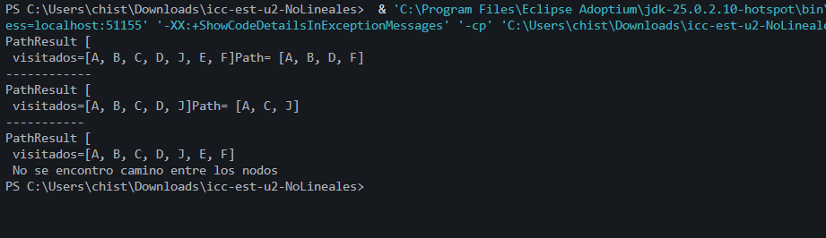
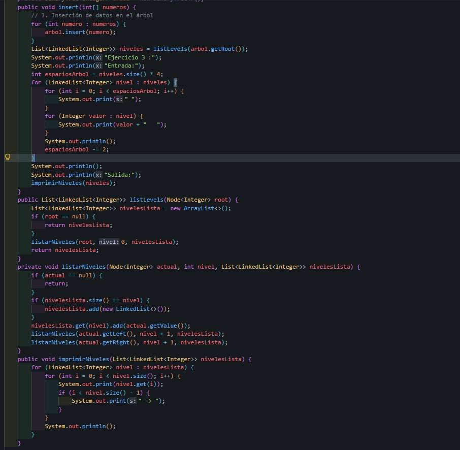
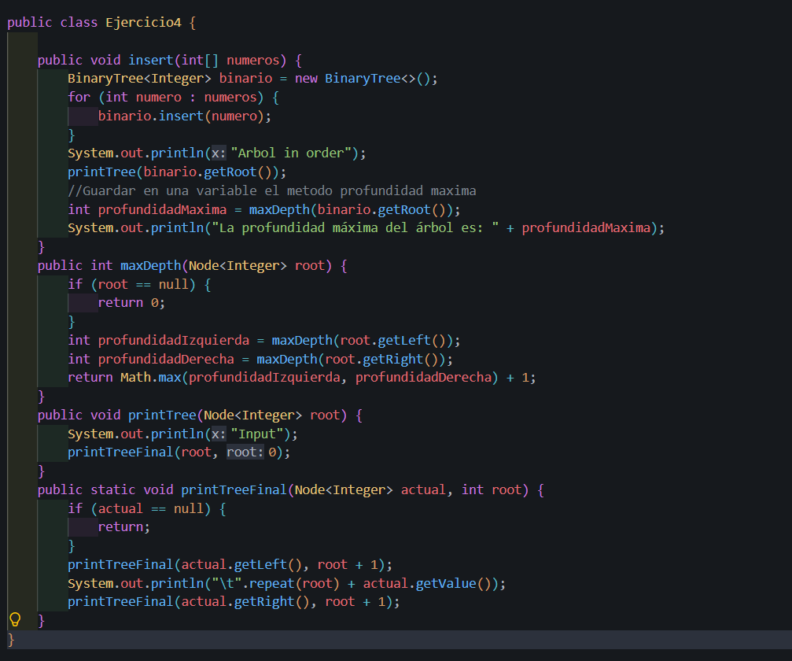
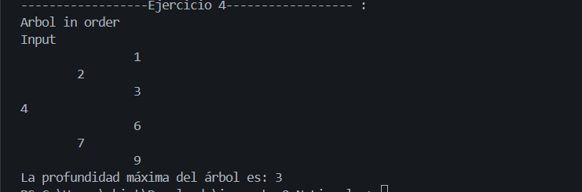

## Informe Ejercicio hechos en Clase de Arboles Binarios

Nombre: Christian Villa

Fecha: 22/06/2026

Practica: Ejercicios hechos en clase 

# Ejercicios
## Ejercicio 1
`Arbol en in-orden en vertical`
Clase Ejercicio 1 - Metodos:
```java
public void insert(int[] numeros) {
        BinaryTree<Integer> binario = new BinaryTree<>();
        for (int numero : numeros) {
            binario.insert(numero);
        }
        System.out.println("Arbol in order");
        printTree(binario.getRoot());
}
```

Metodo Insert del Ejercicio 1 : Lo que hace este metodo es crear un arbol binario vacio y con el `for`  va colocando cada numero del arreglo dentro del arbol  , y al final lo imprime en In-Order

```java
    public void printTree(Node<Integer> root) {
        System.out.println("Imprimiendo el arbol");
        printTreeRecursivo(root, 0);
    }

    
    public void printTreeRecursivo(Node<Integer> actual, int nivel) {
        if (actual == null) {
            return;
        }
        printTreeRecursivo(actual.getRight(), nivel + 1);
        System.out.println("\t".repeat(nivel) + actual.getValue());
        printTreeRecursivo(actual.getLeft(), nivel + 1);
    }
```
Metodos `printTree` y `printTreeRecursivo` del Ejercicio 1 : El primer metodo es solo el que va a iniciar todo el proceso empezando desde la raiz y llamando al metodo `printTreeRecursivo` y le indica que tiene q ir desde el nivel 0 .Ahora el metodo `printTreeRecursivo` es el que va a recorrer de forma recurisiva todo el arbol  empezando por el lado derecho despues el nodo actual y al ultimo el nodo izquierdo y al final podremos ver en la terminal la imp#resion del arbol en forma vertical.

### App
```java
    private static void runEjercicio() {
        Ejercicio1 ejercicio = new Ejercicio1();

        int[] datos = new int[] { 5, 3, 7, 2, 4, 6, 8 };
        ejercicio.insert(datos);

    }
```
App Del Ejercicio 1: Para hacer mas facil la llamada en el app hacemos un metodo que se llame `runEjercicio()` en el cual vamos a insertar el arreglo de numeros que hayamos tenido como ejemplo y despues llamar al metodo insert de la clase `Ejercicio1` el cual nos dara el arbol binario ya hecho y listo para mostrar en el terminal. y lo llamamos solamente con `  runEjercicio(); `

### Impresion en el Terminal


## Ejercicio 2 
`Imprimir un arbol original y un arbol invertido`
Clase Ejercicio2 - Metodos:
```java
    public void insert(int[] numeros) {
        BinaryTree<Integer> binario = new BinaryTree<>();
        for (int numero : numeros) {
            binario.insert(numero);
        }
        System.out.println("Arbol in order");
        printTree(binario.getRoot());
        Node<Integer> invertido = invert(binario.getRoot());

        System.out.println("Arbol invertido");
        printTree(invertido);

    }
```
Metodo `Insert ` del Ejercicio 2: En este metodo `insert` es identico al del ejercicio pasado al cual le creamos un arbol binario vacio ,recorremos el arbol y insertamos los numeros en el arbol de ahi llama a los metodos de imprimir `printTree` para el normal y el invertid lo llamamosy lo guardamos en una variabl para asi depues imprimirlo.
```java
    public Node<Integer> invert(Node<Integer> root) {
        return invertRecursive(root);
    }
```
Metodo `invert` del Ejercicio1: Este metodo es el que va a recibir la raiz de un arbol ,Este metodo manda  a otro metodo `invertRecursive` y manda dicha raiz  para que el otro metodo haga todo lo de invertir y eso.

```java
    private Node<Integer> invertRecursive(Node<Integer> root) {

       // Caso base: si el nodo es null, no hay nada que invertir
        if (root == null) {
          return null;
        }

        // Llamada recursiva para invertir el subárbol izquierdo
        Node<Integer> left = invertRecursive(root.getLeft());

        // Llamada recursiva para invertir el subárbol derecho
        Node<Integer> right = invertRecursive(root.getRight());

        // Intercambia los hijos del nodo actual
        // El izquierdo pasa a ser el derecho invertido
        root.setLeft(right);
        // El derecho pasa a ser el izquierdo invertido
        root.setRight(left);
        // Retorna el nodo ya con sus hijos invertidos
        return root;
    }
```

Metodo`invertRecursive` del Ejercicio2 : Este es el metodo que se encarga de invertir todo el arbol empezando con una comparacion para verificar que haya elementos en dicho arbol y despues continua con las llamadas recursivas tanto a la izquierda y a la derecha para asi al final intercambiar el derecho al izquierdo y el izquierdo con el derecho , y finalmente retornar el nodo ya con los hijos invertidos.

```java
public void printTree(Node<Integer> root) {
    System.out.println("Imprimiendo el arbol");
    printTreeFinal(root, 0);
}

public static void printTreeFinal(Node<Integer> actual, int root) {
    if (actual == null) {
        return;
    }
    printTreeFinal(actual.getRight(), root + 1);
    System.out.println("\t".repeat(root) + actual.getValue());
    printTreeFinal(actual.getLeft(), root + 1);
}
```
Metodos `printTree` y `printTreeFinal` del Ejercicio2: En el primer metodo tendremos los mismo que en el ejercicio 1 le mandaremos una raiz indicandole desde que nivel debe empezar, para asi seguir con el metodo `printTreeFinal` el cual primero recibira esa raiz la verificara sisque hay algo y despues empezara recorriendo el subarbol derecho para imprimirlo en la parte superior imprimir los nodos y al final recorrer el subarbol izquierdo para imprimirlo en la parte inferior.

### App
```java
    private static void runEjercicio2() {
        System.out.println("-------------------Ejercicio 2----------------- :");
        Ejercicio2 ejercicio = new Ejercicio2();

        int[] datos = new int[] { 5, 3, 7, 2, 4, 6, 8 };
        ejercicio.insert(datos);

    }
```

`App` del Ejercicio2 : En este ejercicio igual que el anterior vamos a crear un metodo q se llame `runEjercicio2()` , Despues instanciamos una variable con la `Clase Ejercicio2` para asi poder usar sus metodos de ahi primero imprimimos el arbol normal y por ultimo llamar al arbol invertido y lo imprimimos finalmenet llamamos al metodo asi `runEjercicio2`.

### Impresion en el Terminal


### Ejercicio 3 :
`Lista Enlazada`
```java
    public void insert(int[] numeros) {
        for (int numero : numeros) {
            arbol.insert(numero);
        }
        List<LinkedList<Integer>> niveles = listLevels(arbol.getRoot());

        System.out.println("Ejercicio 3 :");
        System.out.println("Entrada:");

        int espaciosArbol = niveles.size() * 4;
        for (LinkedList<Integer> nivel : niveles) {
            for (int i = 0; i < espaciosArbol; i++) {
                System.out.print(" ");
            }
            for (Integer valor : nivel) {
                System.out.print(valor + "   ");
            }
            System.out.println();
            espaciosArbol -= 2;
        }

        
        System.out.println();
        System.out.println("Salida:");
        imprimirNiveles(niveles);
    }
```
Metodo `insert` del Ejercicio3 : Primero vamosa  recorrer el arreglo de numeros que dimos com parametro para despues insertarlso en el arbol, despues obtenemos una lista para despues mostrar los datos originales y calcular el numerod e espacios q hay para q se vea igual a el ejemplo para el primer for es  solo para  poner los espacios y el otro sirve para imprimir el nivel actual para despues llamar al metodo `Imprimir niveles` y asi mostarlo enpantalla.
```java
    public List<LinkedList<Integer>> listLevels(Node<Integer> root) {

        List<LinkedList<Integer>> nivelesLista = new ArrayList<>();

        if (root == null) {
            return nivelesLista;
        }
        listarNiveles(root, 0, nivelesLista);
        return nivelesLista;
    }
```
Metodo `listLevels` del Ejercicio3 : Se crea una lista vacia y en cada posicion vamos a tener una linkedlist con cada nodo, hacemos la comparacion a ver si el arbol esta vacio o no, para despues llamar al metodo `listarNiveles ` indicandole desde que nivel debe empezar  y el nodo actual para al finar devolvernos ya el arbol ordenado
```java
    private void listarNiveles(Node<Integer> actual, int nivel, List<LinkedList<Integer>> nivelesLista) {
        if (actual == null) {
            return;
        }

        if (nivelesLista.size() == nivel) {
            nivelesLista.add(new LinkedList<>());
        }
        nivelesLista.get(nivel).add(actual.getValue());
        listarNiveles(actual.getLeft(), nivel + 1, nivelesLista);
        listarNiveles(actual.getRight(), nivel + 1, nivelesLista);
    }

    public void imprimirNiveles(List<LinkedList<Integer>> nivelesLista) {
        for (LinkedList<Integer> nivel : nivelesLista) {
            for (int i = 0; i < nivel.size(); i++) {
                System.out.print(nivel.get(i));

                if (i < nivel.size() - 1) {
                    System.out.print(" -> ");
                }
            }
            System.out.println();
        }
    }

```
Metodos`listar niveles y imprimir niveles` del Ejercicio 3: El primer metodo de `listarNiveles` va a recorrer recursivamete a el arbol binario y va a guardar ca nodo en una lista segun sus niveles al que pertenece y el otro metodo `imprimirNiveles` este metodo recorre la lista de niveles que se genero ates y muestra los valores en la pantalla y ambos van a permitir organizar los nodos y visualizarlos de forma ordenada.

## App
```java
    private static void runEjercicio3() {
        System.out.println("---------------Ejercicio 3-------------- :");
        Ejercicio3 ejercicio3 = new Ejercicio3();
        int[] numeros = { 4, 2, 7, 1, 3, 6, 9 };
        ejercicio3.insert(numeros);
    }
```

`App` del ejercicio3 : En el App Vamos a instanciar la clase `Ejercicio3` para haci poder utilizar sus metodos  llamando al insert ya que ese es el que tiene todos los metodos de la clase para darnos al arbol impreso.

### Impresion en el Terminal



### Ejercicio 4 :
`Profundidad maxima`
```java
    public void insert(int[] numeros) {
        BinaryTree<Integer> binario = new BinaryTree<>();
        for (int numero : numeros) {
            binario.insert(numero);
        }
        System.out.println("Arbol in order");
        printTree(binario.getRoot());

        //Guardar en una variable el metodo profundidad maxima 
        int profundidadMaxima = maxDepth(binario.getRoot());

        System.out.println("La profundidad máxima del árbol es: " + profundidadMaxima);
    }
```
Metodo `insert ` de el Ejecicio4 : Primero creamos un arbol binario vaci para despues con el for ir insertando numeros en dicho arbol  vamos a imprimir el arbol original osea sin cambos para despues llamar el metodo `maxDepth` y guardarlo en una variable y despues poderla imprimir.
```java
    public int maxDepth(Node<Integer> root) {

        if (root == null) {
            return 0;
        }

        int profundidadIzquierda = maxDepth(root.getLeft());
        int profundidadDerecha = maxDepth(root.getRight());

        return Math.max(profundidadIzquierda, profundidadDerecha) + 1;

    }
```
Metodo `maxDepth` del Ejercicio4 : En este metodo vamos primero a verificar si el arbol tiene o no tiene algo  para despues guardar en una variable entera las respectivas profundidades de ambos lados para el ultimo retornar la profundidad maxima entre ambos.
```java
    public void printTree(Node<Integer> root) {
        System.out.println("Input");
        printTreeFinal(root, 0);
    }

    public static void printTreeFinal(Node<Integer> actual, int root) {
        if (actual == null) {
            return;
        }
        printTreeFinal(actual.getLeft(), root + 1);
        System.out.println("\t".repeat(root) + actual.getValue());
        printTreeFinal(actual.getRight(), root + 1);
    }
```
Metodo `printTree y printTreeFinal` del Ejercicio4: estos dos metodos es  lo que nos va a retornar ya losarboles impresos pero en el primero`printTree` vamosa incicarle al prinTreeFinal que debe empezar desde el nivel 0 , en el otro `printTreeFinal`  si el nodo es nulo va a terminar la recursion primero va a recorrer el subarbol izquierdo imprime el valor y las taulaciones y despues imprimir el subarbol derecho.
## App
```java
    private static void runEjercicio4() {
        System.out.println("------------------Ejercicio 4------------------ :");
        Ejercicio4 ejercicio4 = new Ejercicio4();
        int[] numeros = { 4, 2, 7, 1, 3, 6, 9 };
        ejercicio4.insert(numeros);
    }
```
`App` del ejercicio4 :En el app instanciamos la clase del Ejercicio4 para haci usar sus metodos para llamar el insert de la clase Ejercicio4 .

### Impresion en el Terminal

## Tabla de resultados 
| Ejercicio | Evidencia de código | Evidencia de consola | Observación |
|----------|---------------------|----------------------|-------------|
| Ejercicio 01: Insertar en BST |  |  |Es un ejercicio interesante aunque primero no sabes ni por dodne empezar pero de ahi te das cuenta que es medio facil seguir la estructura de primero verificar de ahi crear metodos que nos permitan invertir o insertar directamente pero al final se hace medio facil entender el codigo |
| Ejercicio 02: Invertir árbol binario | |  | Podeos ver que la estrcutura del codigo es como lo que ya hemso venido practicando hace un tiempo es cierto que cambian ciertas cosas pero son medio faciles de entender como la modificacion del orden en el q se van a aimprimir como recorremos los subarboles y como los intercambiamos.|
| Ejercicio 03: Listar niveles |  |  | En este codigo partimos de   la creciond euna lista para asi poder empezar a hacer el arbol y si irlos comparando e irlos imprimiendo asi que es facil pero medio largo este metodo.|
| Ejercicio 04: Profundidad máxima |  |  | En este ultimo codigo es para verificar cuantos niveles tiene al arbol pero como esta de forma horizontal es de la misma forma no cambia en nada para eso ocupamos el Math.max entre ambos tanto el izquierdo como el derecho. 67890'`+¡Ç+`P9O8 76543|


